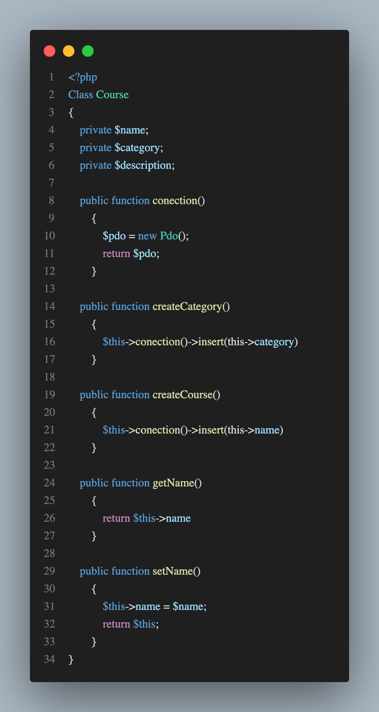
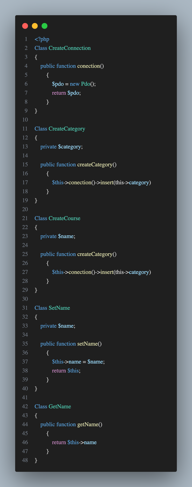
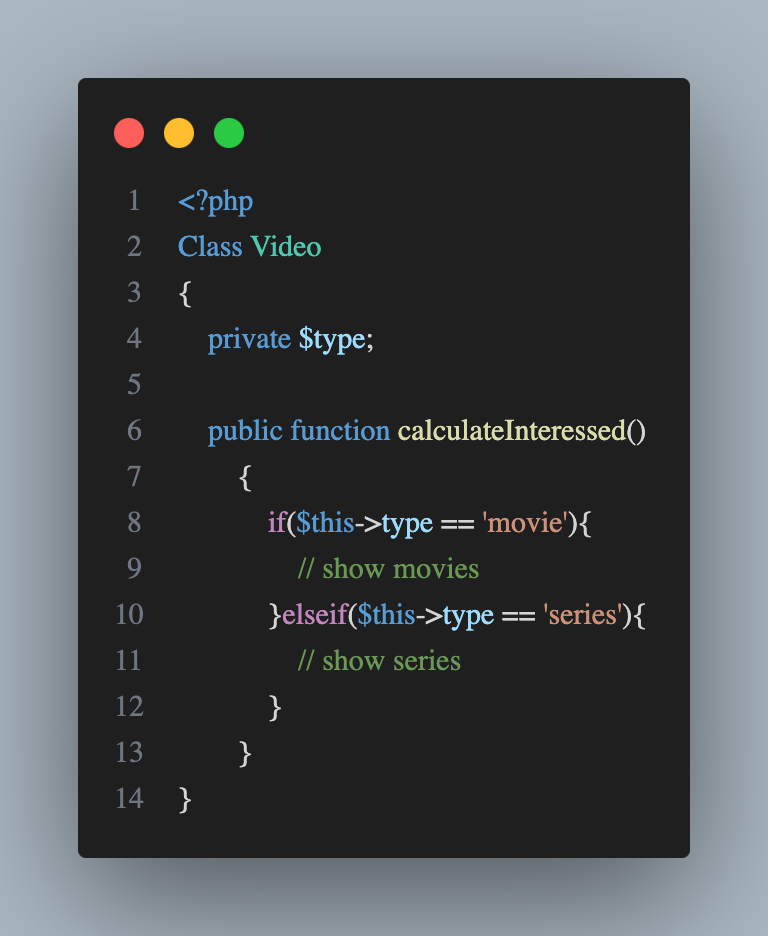
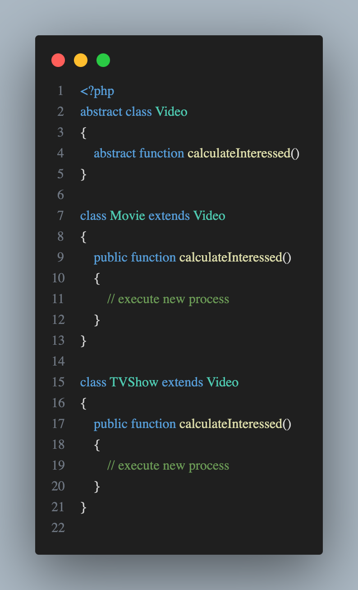
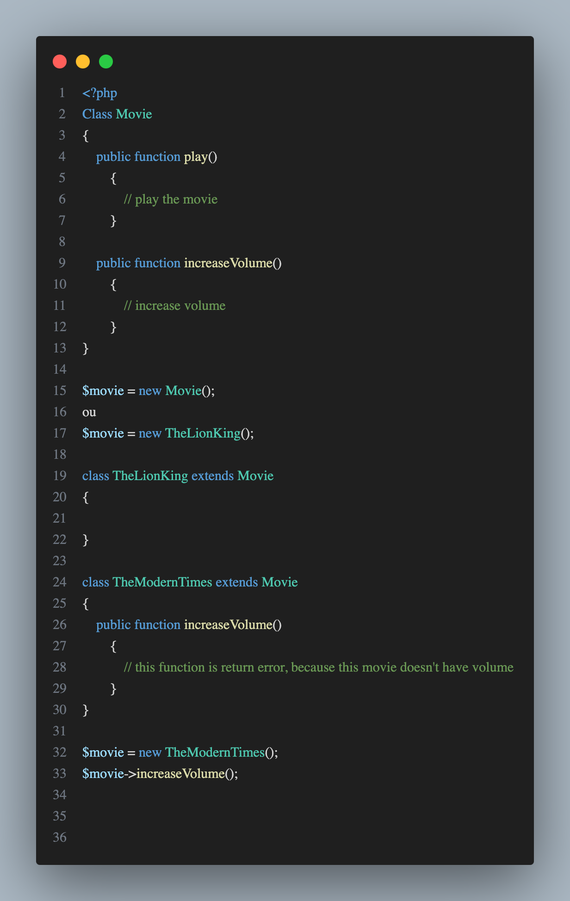
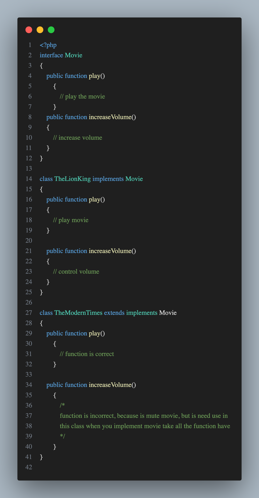
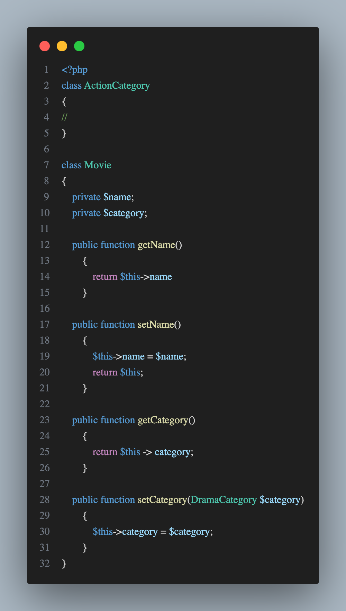
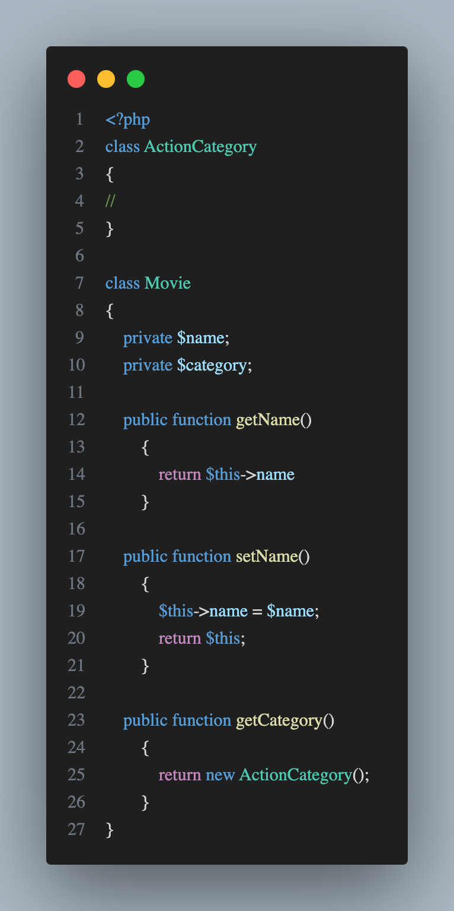
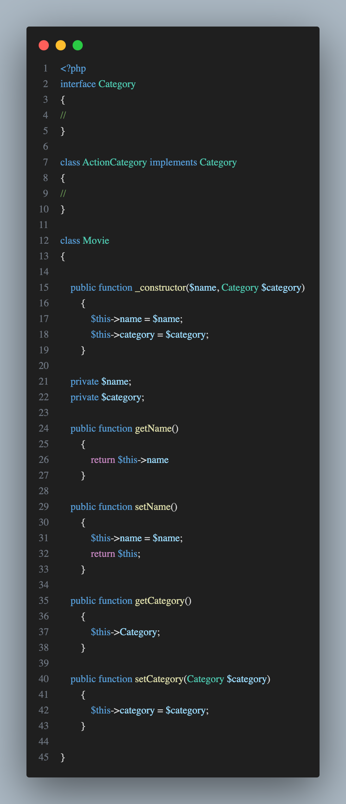

### SOLID

Criado no livro: [Agile Software Development, Principles, Patterns, and Practices](https://www.amazon.com/Software-Development-Principles-Patterns-Practices/dp/0135974445)

## SRP

**Single Reponsability Principle**

Um classe deve ter apenas uma responsabilidade, a classe deve ter apenas um motivo para mudar, se tiver mais
de um ela está ferindo o princípio do solid.

**Exemplo de Classe com várias responsabilidades**

**Exemplo de Classe com única responsabilidade**

## OCP

**Open-closed Principle**

Toda classe deve ser aberta para extensão e fechada para modificação, criar uma base e toda vez que precisar
incrementar pegar a base e extender em cima dela sem a necessidade de criar algo muito grande e necessitar
alterar por completo quando precisar incrementar algo.

**Exemplo de Classe fechada para extensão**

**Exemplo de Classe aberta para extensão**

## LSP

**Liskov Substitution Principle**
As sub classes podem ser substituídas pelas classes pai

**Exemplo de Classe com Liskov Substitution Principle**

## ISP

**Interface Segregation Principle**
Uma classe não é obrigada a implementar métodos que não vai utilizar!

**Exemplo de Classe sem Interface Segregation Principle**

**Exemplo de Classe com Interface Segregation Principle**

## DIP

**Dependency Inversion Principle**
Depender de abstrações e não de implementações, abstrações são modelos básicos para incrementar e implementações são classes concretas.

**Exemplo de Classe dependendo de implementações**

**Exemplo de Classe dependendo de implementações**

**Exemplo de Classe com abstração**

